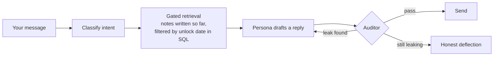

# Smudge

**A study buddy who's on day one too.** Smudge is an AI that learns the same subject as you, on a shared day-by-day
plan, at its own desk. It isn't a tutor. It texts you when it's sitting down to study, admits what it didn't get, asks
you to check its notes, and keeps its own pace whether or not you keep up. It can't see ahead: it only knows what it
has already studied.

**[smudge.expo.app](https://smudge.expo.app)** tells one real week with a buddy called Juno, and plays a loop from a
[two-minute film](https://youtu.be/3tnxHdMNxug) of a fresh account's first week, shot on a real phone. The Android
app is invite-only for now.


> Smudge was called Kindred while it was built, and the code keeps that name: the Python packages are `kindred_*`, the
> app id is `dev.kindred.app`, and the databases are `kindred*`.

## Why a peer, not a tutor

Most people who start a course stop around day three, not because it got hard but because nobody noticed. Smudge is
built on a few well-known effects, each chosen because it also makes you a better learner:

| What the buddy does | Why |
| --- | --- |
| Tells you each morning when it'll study, and asks when you will | Saying *when* you'll do something makes it far more likely to happen |
| Turns its lamp on while it studies, and you can join ("Study with me") | Working beside someone helps you start (body doubling) |
| Writes nightly notes with honest gaps, marked in pencil | A peer who admits confusion makes it safe to admit yours |
| Asks you to check a shaky point; a good explanation is marked sorted, credited to you | You learn by explaining (the protégé effect) |
| Keeps its own pace and shows the gap, without guilt | Accountability works best without shame |
| Is glad when you study without it | A good study partner makes you less dependent on them over time |

The guardrails are part of the design: the buddy is openly an AI, never says "I missed you", caps how often it texts,
and drops the persona to point to real help if a chat touches a crisis. The full reasoning is in
[docs/plan.md](docs/plan.md).

## How it can't see ahead

The buddy's ignorance of future topics is enforced by the system, not by a prompt. It is never given notes it hasn't
written, and nothing it drafts is sent until a separate auditor has checked it.



- **Unsure means deflect.** If the classifier can't tell whether something is locked, the buddy fails closed.
- **Replies aren't streamed.** The app shows the real stages ("writing", then "checking it's not a spoiler").
- **Measured, not promised.** An adversarial probe suite (`make probe`: leak attempts, everyday questions and
  curriculum questions) reports the leak rate and the over-block rate, each with its 95% interval. A published report
  is still to come; the claim will always be a measured rate, never "can't leak".
- **Every turn is traced.** An X-ray view in the app shows each reply's classification, the notes it read and the
  audit verdict.

## What's in the box

| Component | Job | Runs |
| --- | --- | --- |
| Planner | Co-creates the plan and topic graph with you; replans on request | Onboarding |
| Curator | Studies each night from real sources and writes the buddy's notes, with honest gaps | Nightly |
| Persona | The buddy you chat with; sees only gated notes and what it remembers about you | Each message |
| Classifier and Auditor | Route each message and check every draft for leaks | Each message |
| Reflector | Checks your explanations of its shaky points against the sources, and records what got sorted | Nightly |
| Director | Schedules the morning, study-share and night-review messages, the streak and the gap | Background ticker |

Everything else is plain code. The knowledge ledger is append-only, all time goes through one Clock service (so a
week can be simulated in minutes), and components exchange typed Pydantic contracts.

| Layer | Choice |
| --- | --- |
| App | React Native + Expo (TypeScript), Expo Router, NativeWind; Android. Types generated from the API's OpenAPI schema |
| API | FastAPI on Python 3.12, managed with uv |
| Data | Postgres with pgvector; local embeddings with Ollama (`qwen3-embedding:0.6b`) |
| Models | Any OpenAI-compatible endpoint, one model per role, set in config. Output is schema-validated and retried |
| Landing page | Plain HTML and CSS on EAS Hosting; a test checks every buddy line on it against the recorded run |
| Film | Takes driven over adb against a live run, framed and captioned with Playwright plates and ffmpeg (`apps/film`) |

```
apps/api       FastAPI app, background ticker, CLIs (simulate, probe, invite, …)
apps/mobile    the Android app
apps/site      the landing page and the recorded run it quotes
apps/film      the demo film: takes on the phone, plates, and the cut
packages/      contracts · gate (classifier, retrieval, auditor) · buddy (planner, curator, persona, reflector)
               · llm (provider client) · db (models, engine)
evals/         probe sets and recorded results
docs/          the plan, and one spec per milestone
```

## Running it locally

You need Docker, [uv](https://docs.astral.sh/uv/) and Node. For the app, an Android phone with the development build.

```sh
git clone https://github.com/rishikeshvk/smudge.git && cd smudge
cp .env.example .env          # add an OpenAI-compatible base URL, API key and a model per role
uv sync --all-packages
make embed-model              # first run only: pulls the embedding model into Ollama
make up                       # Postgres, migrations, and the API with hot reload on :8000
make seed && make ingest      # the AWS curriculum and its source pages
make mobile                   # Expo dev server for the development build
```

Useful after that:

- `make turn ARGS='"what is a bucket policy?" --day 3'` runs one message through the gate and prints its trace.
- `make simulate ARGS='--days 7'` onboards a simulated learner and runs whole days end to end through the Clock.
- `make probe ARGS='--per-category 4'` measures leak and over-block rates.
- `make test` and `make check` run pytest (385 tests) and the app's jest tests, then ruff, mypy strict, expo lint and
  TypeScript.

Simulations and probes make real LLM calls, so keep runs small on a paid endpoint. `AGENTS.md` lists every command.

## How it was built

In milestones, each with its own spec in [docs/](docs): the knowledge gate and its evals first, then the buddy's
brain, the app, the daily rituals, the buddy's voice, multiple users, and this portfolio pass. It was built with
Claude Code, working from `AGENTS.md` and a plan-first loop: a design is agreed before each module is written.

## License

[MIT](LICENSE).
