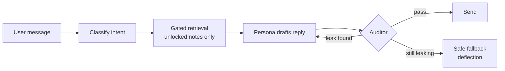

# Kindred — Plan & Philosophy

2026-09-22 · @Someone

## What Kindred is

Kindred is an AI study buddy that learns the same subject as you, on a shared plan it keeps to whether or not you keep up, and only knows what it has covered so far. It is a peer, not a tutor or mentor: it brings accountability and company, and helps only a little.

**USP:** not a tutor, but a buddy working toward its own goal alongside yours, whose ignorance of what's ahead is real rather than role-played.

Kindred is the working name, as in kindred spirits: two learners on the same path. The first goal is a portfolio-grade Android app, plus measured proof that the knowledge limit holds.

## Philosophy

These principles decide trade-offs when the plan is silent.

1. **Honest fiction.** The buddy is openly an AI. Its not-knowing is enforced by the system, so the product never lies to you.
2. **Help you struggle, don't let you skip.** Struggle is where learning happens. When the buddy can't help, it deflects warmly, never with a refusal wall.
3. **Accountability without guilt or coddling.** No shaming, but no waiting either. The buddy keeps its own schedule and never says "it's fine" when it isn't, so falling behind is felt, not scolded.
4. **Celebrate independence.** The buddy is happy when you study without it. No engineered neediness.
5. **Workflows over agents.** Use plain code, cron jobs and templates wherever they work. LLM calls only where they earn their cost.
6. **Cheap by default.** The buddy's "life" is generated in scheduled batches, not by an always-on agent. Small models wherever possible.

## How it works

You set a goal, build a day-by-day plan together, and then both of you study it in parallel, checking in like friends texting.

**Onboarding.** You state a goal and timeframe, e.g. "learn AWS in 8 weeks, 1 hour a day". The buddy pushes back gently if it's unrealistic, then you co-create the roadmap.

| Moment | What happens |
| --- | --- |
| Morning | Buddy shares today's plan and when it will study ("doing mine around 7pm, you?"). |
| Study share | Buddy reports what it studied, including what felt shaky, and makes one small ask. |
| Night review | Mutual check-in on the day; the shared streak updates. |
| Anytime | Chat freely: discuss a topic, compare notes, complain about a hard concept. |

**Pacing.** The buddy keeps its own pace and doesn't wait for you, like a real peer. If you stall, it moves on and the gap shows on the roadmap; it won't pretend that's fine. Need a topic early? Pull it forward on the shared roadmap; the buddy studies it that night, honestly.

## The knowledge gate

The buddy can't reveal future topics because it never receives them, and nothing it says is sent until a separate auditor passes it. The guarantee lives in the system, not in the prompt.

**Topic graph.** The roadmap is broken into concept nodes. Each node has an unlock date, prerequisites and a vocabulary list (terms, synonyms, abbreviations). A **baseline card** sets what a curious adult knows before day one, e.g. that AWS is Amazon's cloud.

Each message is classified before the buddy replies:

- **Learned:** answers from its own notes, shaky parts included. If it's ahead of you, it says how the topic went but won't teach it before you've tried.
- **Future:** gets a deflection directive, never the content ("that's our week 6 stuff, pull it earlier?").
- **Off-topic or meta:** general knowledge is fine. Asked if it's an AI, it says yes, and that it truly can't see ahead.
- **Unsure:** fail closed and deflect.

Replies are not streamed, since they only ship after the audit; the UI shows a typing indicator instead. Every turn is logged, and an adversarial probe suite reports two numbers: **leak rate** and **over-block rate**. We claim a measured leak rate, never "can't leak".

## System components

Six components use an LLM; everything else is plain code.

| Component | Job | Runs | Model tier |
| --- | --- | --- | --- |
| Planner | Co-creates the roadmap and topic graph with you; replans when you ask | Onboarding, replans | Mid/large |
| Curator | Writes the buddy's daily study notes (with deliberate gaps) and drafts the day's messages | Nightly batch | Mid |
| Persona | The buddy you chat with; sees only gated notes and relationship memory | Each message | Mid/large |
| Auditor | Classifies incoming messages and checks every draft for leaks | Each message | Small, swappable (first knob to turn if leaks are high) |
| Reflector | Checks what you explained about the buddy's shaky points against the topic's sources, and records what got sorted | Nightly batch | Mid |
| Director | Schedules ritual messages, tracks streaks and the gap between you | Cron | Mostly code |

**Two memories, kept apart.** The knowledge ledger (append-only study notes) is *what the buddy knows*. Relationship memory (facts about you, conversation summaries) is *who you are to each other*.

## Psychology, done ethically

Every psychological mechanic must also make you a better learner; anything that only boosts attachment or retention is out.

| Mechanic | How it shows up |
| --- | --- |
| Ben Franklin effect | Small asks ("can you check my note on IAM roles?"), each one also retrieval practice for you |
| Protégé effect | You learn by explaining things to the buddy, and a point you explain well gets sorted in its notebook, credited to you |
| Body doubling | "Study with me" while the buddy's session runs: both lamps on, then compare notes |
| Commitment device | The morning "when are you studying today?" exchange |
| Shared streak | "We're 9 days in": something you protect together, not a guilt counter |
| Imperfect peer | Its notes have real gaps and struggles, so it feels like a fellow learner |
| Keeping pace | The buddy moves on without you, so the gap itself motivates you to catch up |

**Guardrails:**

- Openly AI; never claims to be human.
- No guilt or "I missed you" messages; a daily cap on outbound messages.
- Crisis rule: if a chat touches self-harm or crisis, the buddy drops the persona and points to real help.
- Adults only for any public launch, since companion-chatbot laws (e.g. California SB 243) would likely apply.

To explore later: spacing and testing effects, and the goal-gradient effect.

## MVP scope

The MVP is the full core idea as a working Android app; only infrastructure and one costly feature are deferred.

**In the MVP:**

- **Android app screens:** onboarding and co-planning chat; chat thread where daily rituals arrive; shared roadmap (locked and unlocked topics, both progress bars); the buddy's notebook; streak.
- **Ritual notifications:** morning, study-share and night-review messages arrive as push notifications, like texts from a friend.
- **Settings (bring your own key):** LLM base URL, API key and a model per role.
- **Buddy unavailable state:** when the LLM endpoint fails (usage limits, outages), the app shows the buddy as unavailable instead of an error. Your messages queue and get answered once it's back.
- **X-ray view:** a toggle showing each turn's classification, retrieved notes and audit verdict. This is the portfolio demo.
- **All five components**, daily rituals, the catch-up gap, replanning on request, seeded-gap asks.
- **Probe suite** with a leak-rate and over-block report.
- **Time controls (dev only):** fast-forward days via the Clock, for testing and demos.

**Deferred:**

- Full authentication and public sign-up. The multi-user pass adds invite codes for a few invited members.
- Shared code sandbox, the one part of the original idea that isn't cheap.
- iOS and web versions; Telegram/WhatsApp.
- Non-tech domains.
- Production hardening, payments, legal compliance work.

## Tech stack and hard rules

A React Native Android app and a FastAPI backend in one monorepo, Postgres with pgvector, and open-source models through a bring-your-own-key LLM setup.

| Layer | Choice |
| --- | --- |
| App | React Native + Expo (TypeScript), Android only; Expo Router; NativeWind; TS types generated from the API's OpenAPI schema |
| Notifications | expo-notifications for ritual messages |
| Backend | FastAPI, Python 3.12, uv |
| API | REST; the app refetches on open and when a notification arrives |
| Database | Postgres + pgvector (Docker locally) |
| Jobs | APScheduler for the nightly Curator and ritual scheduling |
| LLM | Bring your own key: any OpenAI-compatible endpoint, configured as base URL, API key and one model per role. For now, open-source models via OpenCode Go. Outputs are schema-validated and retried, since open models vary in JSON reliability. |
| Repo | Monorepo: `apps/mobile`, `apps/api`, `packages/` (contracts, gate, llm) |
| Dev tooling | Claude Code, with the rules below in `CLAUDE.md` |

**Hard rules (put these in CLAUDE.md):**

1. The knowledge ledger is append-only.
2. All knowledge retrieval goes through one repository function that applies the unlock-date filter in SQL.
3. Components exchange typed Pydantic schemas, never free-form text.
4. All time goes through a Clock service; never call `datetime.now()` directly.
5. No buddy message ships without an audit pass.
6. When unsure whether content is locked, fail closed.
7. API keys live only on the backend; never logged, never returned to the app.

## Build order

Build the gate first because everything depends on it, but start the frontend early against mocked API contracts.

| Milestone | Delivers | Done when |
| --- | --- | --- |
| M0 Setup | Monorepo, Docker Compose, CLAUDE.md, this doc in the repo, Expo project, LLM endpoint config | API and database start with one command; the Expo app runs on an Android device; one LLM call works through the configured endpoint |
| M1 Gate + evals | Data model, Clock, hand-written 2-week AWS topic graph, gated retrieval, classifier, auditor, probe suite | Leak and over-block rates reported from the CLI |
| M2 Buddy brain | Planner onboarding, source ingestion, nightly Curator, Persona chat, relationship memory, API endpoints | 14 simulated days run end to end via the Clock |
| M3 App | Onboarding, chat, roadmap, notebook, X-ray view, settings, dev time controls | A full day's loop works on an Android phone |
| M4 Rituals | Director, push notifications, streaks, the catch-up gap, replanning on request, seeded-gap asks, message caps | A simulated week feels like a buddy, not a bot |
| Buddy feel | Understated voice and mood, the buddy's study session, check-ins, the Reflector ([spec](buddy-feel-spec.md)) | A simulated day reads like texts from a peer |
| Multi-user | Per-user data, invite-code login, an opening screen ([brief](multi-user-brief.md)) | Two users share one API and neither sees the other's |
| M5 Portfolio | An always-on free host for the invite-only app, a landing page that replays a recorded run, a demo video, a README and a public repo ([spec](m5-spec.md)) | Someone else can install it or watch it |

M3 can run in parallel with M1 and M2 once the typed contracts exist. Buddy feel and Multi-user are unnumbered passes added between M4 and M5. Set target numbers before M1, e.g. under 1% leaks and under 10% over-blocks.

## First curriculum and decisions

AWS is the first curriculum, so you are user number one while you build.

- Scope and timeframe are set in onboarding; M1 uses a hand-written 2-week slice (e.g. IAM, S3, EC2 basics).
- Watch over-blocking: everyday words like bucket, instance, region and role are also AWS terms. The auditor must judge meaning in context, not match keywords.

**Decisions:**

- **Real sources:** the buddy's notes draw on real material (e.g. AWS documentation), not model knowledge alone. Sources are ingested per topic node and gated by unlock date like the notes.
- **Curious guesses allowed:** a future-topic deflection may include a guess ("I bet it relates to IAM"). The auditor still checks that the guess reveals nothing locked.
- **One persona per user, forever:** the same buddy carries across every goal.
- **No deliberate mistakes in chat:** imperfection lives only in the notes' seeded gaps.

**Still open:** final app name (Kindred for now).
